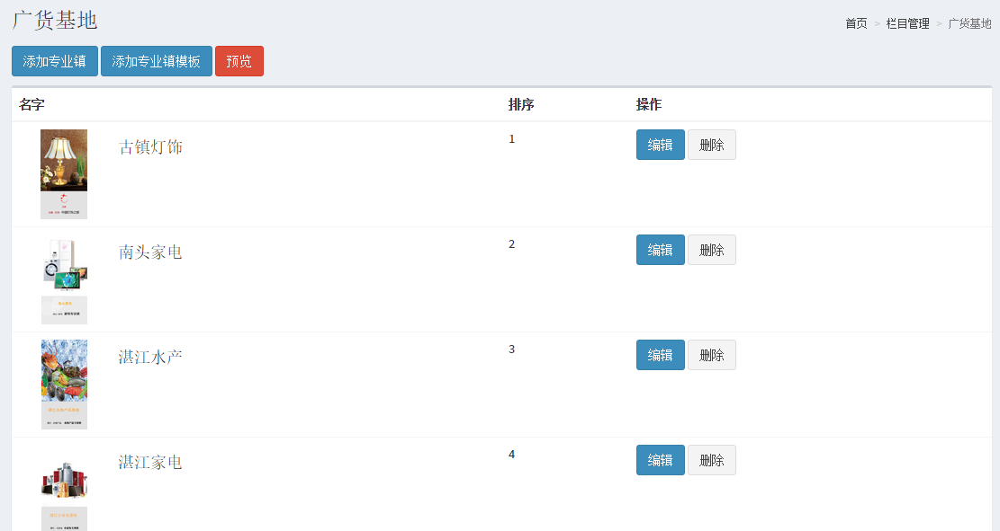

# cms客户端
cms 是使用 Node.js + MongoDB + 客户端vue框架开发的b2b电商平台cms系统,前后端分离  
服务端：[express](https://github.com/crab1127/cms-service)

**主要功能：**  
1. 用户登录、注册
2. b2b行业类目管理
3. 产品增删改查，支持指定页面投放
4. 专业镇，专业市场添加及管理


##开发

```
 git clone https://github.com/crab1127/cms-client.git
 cd cms-client
 npm install 
 npm run dev
 在浏览器中自动打开 http://localhost:8080
```


##目录结构

```
    .  
    |- README.md  
    |- cms               //项目build目录  
    |- src               //生产目录  
    |  |- components     //组件  
    |  |- directive      //指令  
    |  |- filters        //过滤器  
    |  |- util           //函数  
    |  |- views          //视图  
    |  |- main.js        //主入口js  
    |  └─ routers.js     //路由  
    |- index.html        //入口  
    |- package.json      //项目说明  
    |- webpack.config    //webpack配置  
```


##生产环境构建

```
    npm run build
```


##项目截图





